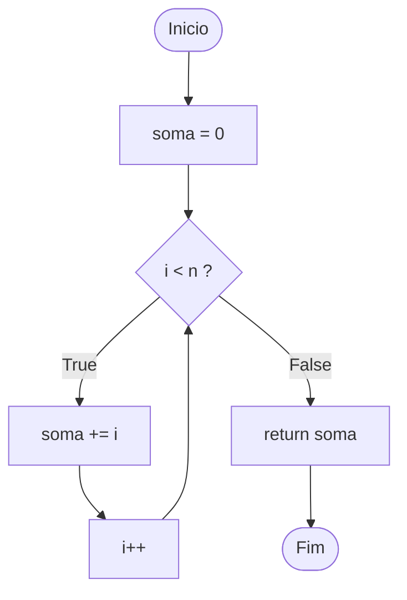

# Exercício 4 — Teste de Ciclo

# Grafo de Fluxo de Controle (GFC)

No Grafo de Fluxo de Controle:

- **Nós** representam blocos de comandos
- **Arestas** representam o fluxo de execução



---

# Complexidade Ciclomática

Fórmula:

V(G) = número de decisões + 1

Decisões no código:

1. `for i in range(n)` (condição do laço)

Portanto:

V(G) = 1 + 1  
V(G) = **2**

Logo existem **2 caminhos independentes**.

---

# Caminhos Independentes

### Caminho 1 — Laço ignorado

Inicio → soma = 0 → condição False → return soma → Fim

### Caminho 2 — Laço executado

Inicio → soma = 0 → condição True → soma += i → volta para condição → ... → return soma → Fim

---

# Testes de Ciclo

Para teste de laços, a técnica recomenda testar:

- **0 iterações**
- **1 iteração**
- **várias iterações**

---

## Caso 1 — Laço ignorado (0 iterações)

Entrada:

n = 0

Execução:

O `range(0)` não executa o laço.

Saída esperada:

```
0
```

---

## Caso 2 — Laço executado uma vez

Entrada:

n = 1

Execução:

```
i = 0
soma = 0 + 0
```

Saída esperada:

```
0
```

---

## Caso 3 — Laço executado várias vezes

Entrada:

n = 4

Execução:

```
i = 0 → soma = 0
i = 1 → soma = 1
i = 2 → soma = 3
i = 3 → soma = 6
```

Saída esperada:

```
6
```

---

# Resumo dos Casos de Teste

| Caso | Entrada | Iterações | Saída Esperada |
|----|----|----|----|
| CT1 | n = 0 | 0 | 0 |
| CT2 | n = 1 | 1 | 0 |
| CT3 | n = 4 | várias | 6 |