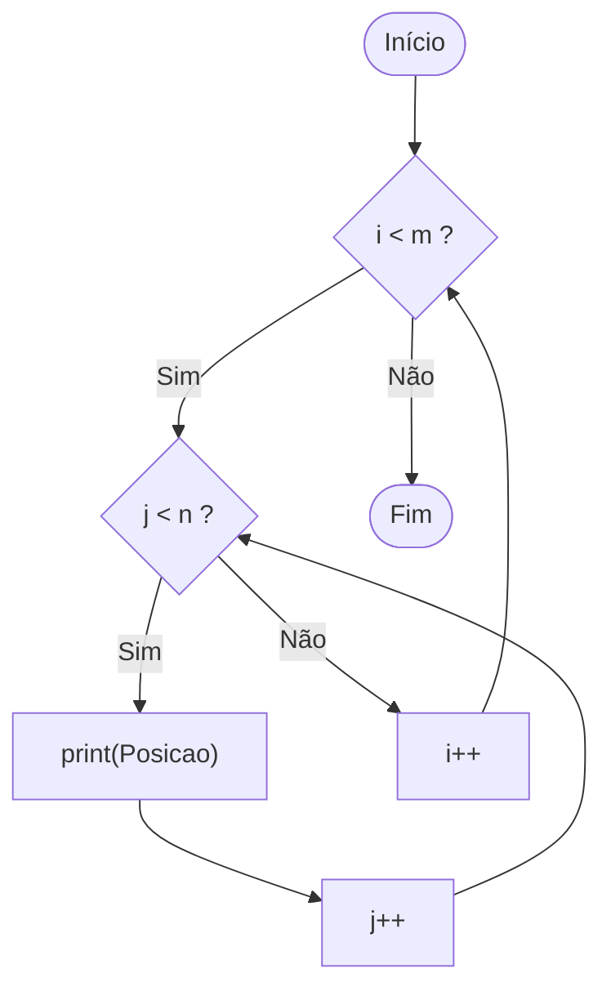

# Exercício 5 — Teste de Ciclo Aninhado

# Grafo de Fluxo de Controle (GFC)

No Grafo de Fluxo de Controle:

- **Nós** representam blocos de comandos
- **Arestas** representam o fluxo de execução



---

# Complexidade Ciclomática

Fórmula:

V(G) = número de decisões + 1

Decisões no código:

1. `for i in range(m)`
2. `for j in range(n)`

Portanto:

V(G) = 2 + 1  
V(G) = **3**

Logo existem **3 caminhos independentes**.

---

# Caminhos Independentes

### Caminho 1 — Ambos os laços ignorados

Inicio → i < m (False) → Fim

---

### Caminho 2 — Laço externo executa, interno ignorado

Inicio → i < m (True) → j < n (False) → i++ → i < m (False) → Fim

---

### Caminho 3 — Ambos os laços executam

Inicio → i < m (True) → j < n (True) → print → j++ → j < n → ... → i++ → ... → Fim

---

# Testes de Ciclo

## Caso 1 — Ambos os laços ignorados

Entrada:

m = 0  
n = 0  

Execução:

Nenhum laço é executado.

Quantidade de prints:

```
0
```

---

## Caso 2 — Apenas o laço j é ignorado

Entrada:

m = 2  
n = 0  

Execução:

O laço externo roda, mas o interno não.

Quantidade de prints:

```
0
```

---

## Caso 3 — Um laço executa uma vez e outro várias vezes

Entrada:

m = 1  
n = 3  

Execução:

```
i = 0
j = 0 → print
j = 1 → print
j = 2 → print
```

Quantidade de prints:

```
3
```

---

## Caso 4 — Ambos os laços executam várias vezes

Entrada:

m = 2  
n = 2  

Execução:

```
(0,0)
(0,1)
(1,0)
(1,1)
```

Quantidade de prints:

```
4
```

---

# Resumo dos Casos de Teste

| Caso | m | n | Execução | Prints |
|----|----|----|----|----|
| CT1 | 0 | 0 | ambos ignorados | 0 |
| CT2 | 2 | 0 | apenas interno ignorado | 0 |
| CT3 | 1 | 3 | um laço 1 vez e outro várias | 3 |
| CT4 | 2 | 2 | ambos várias vezes | 4 |
